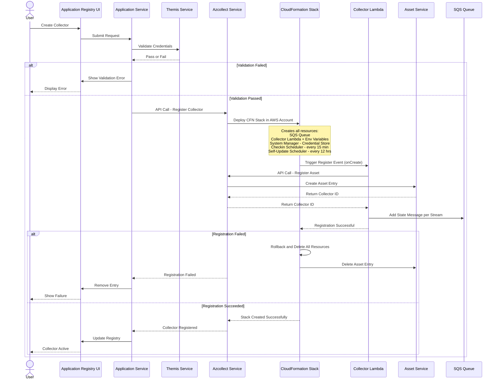
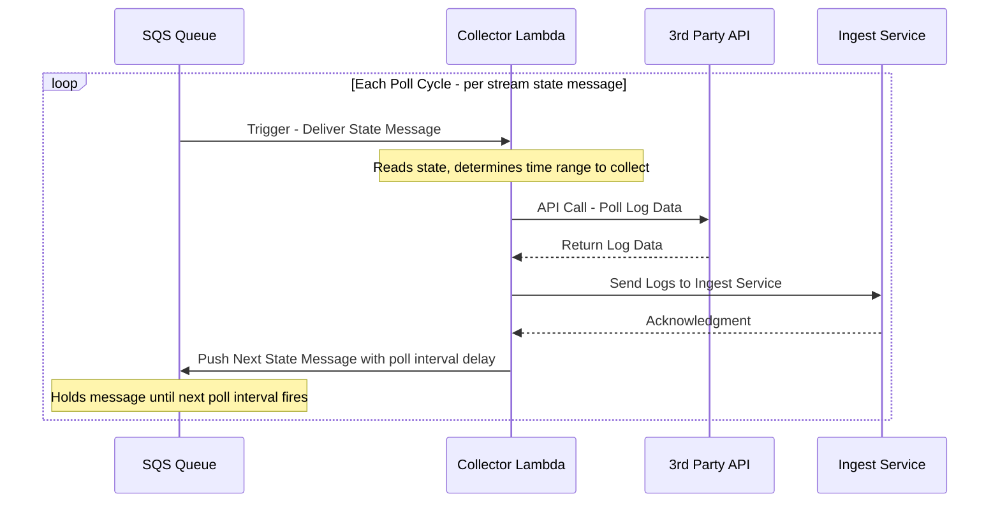
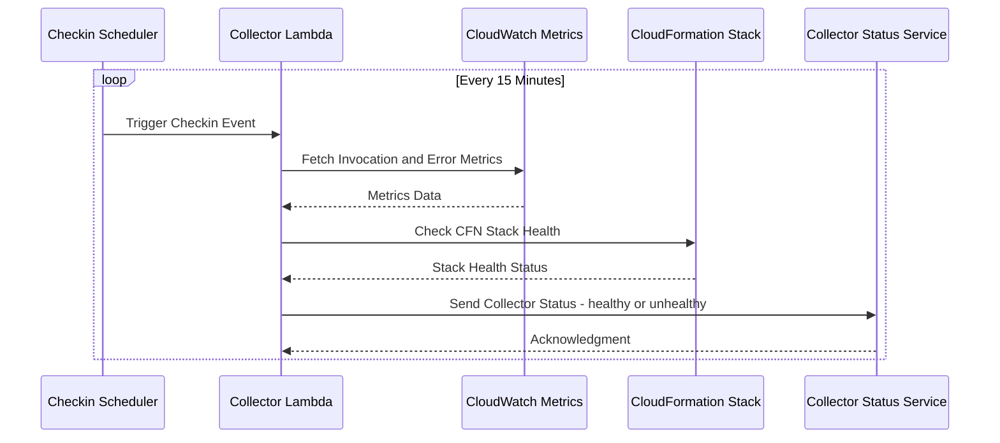
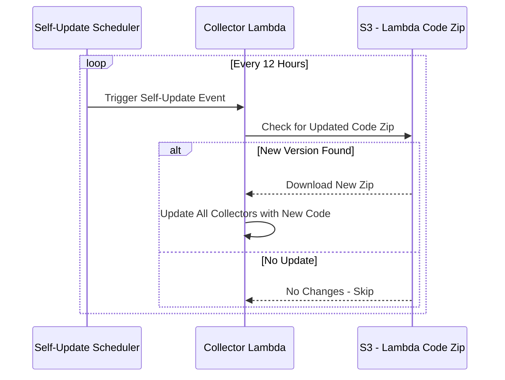
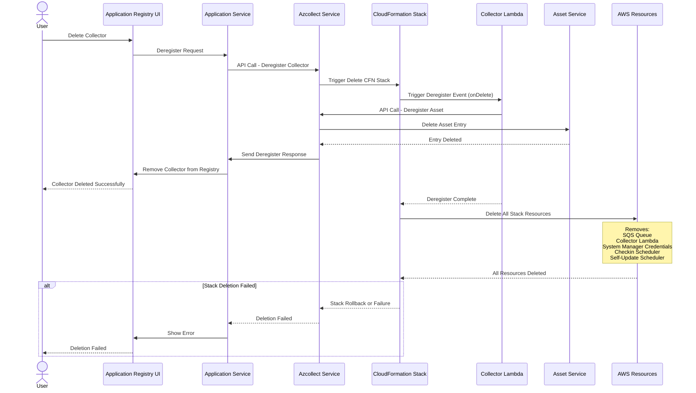
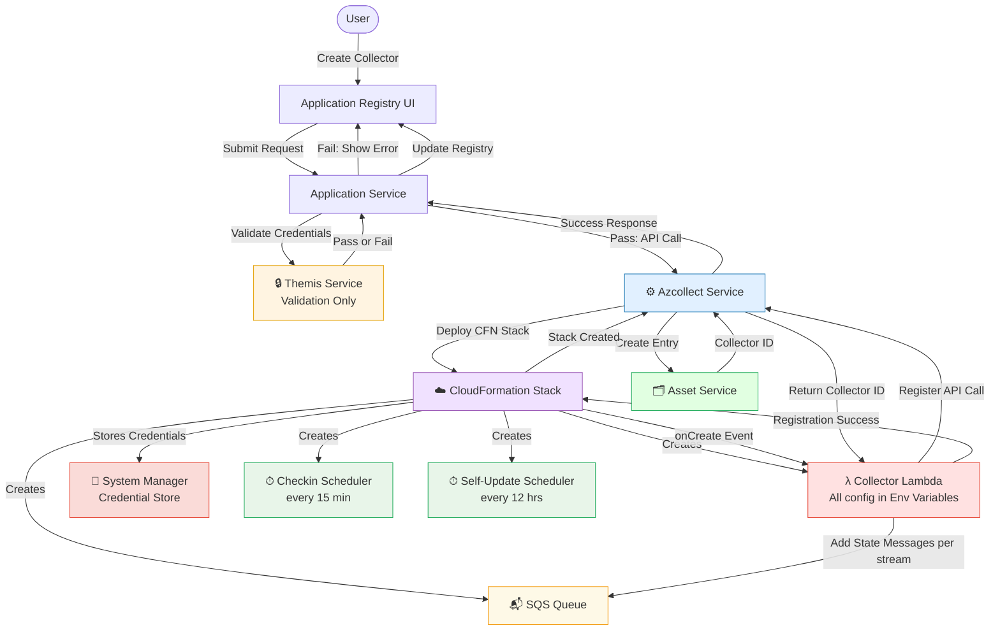

# PAWS Collector — Architecture Document

> This document describes the complete lifecycle of a PAWS Collector — from creation through runtime operation to deletion.
> All diagrams are rendered using Mermaid. View in VS Code with the **Markdown Preview Mermaid Support** extension, or on GitHub natively.

---

## Table of Contents

1. [Registration Flow](#1-registration-flow)
2. [Poll Event Flow](#2-poll-event-flow)
3. [Checkin Event](#3-checkin-event-every-15-minutes)
4. [Self-Update Event](#4-self-update-event-every-12-hours)
5. [Deregistration Flow](#5-deregistration-flow)
6. [Full Architecture Overview — Part A: Collector Creation](#6-full-architecture-overview--part-a-collector-creation)
7. [Full Architecture Overview — Part B: Runtime Events & Deregistration](#7-full-architecture-overview--part-b-runtime-events--deregistration)

---

## 1. Registration Flow

**Key points:**
- **Themis Service** is validation-only — it validates credentials and returns Pass or Fail to Application Service. It has no further involvement.
- **Application Service** decides the next step based on Themis result.
- **Azcollect** deploys the CFN Stack which creates all AWS resources.
- **Lambda** handles the CFN `onCreate` event — registers the asset, gets Collector ID, and seeds SQS with state messages (one per stream).

---

## 2. Poll Event Flow

**Key points:**
- SQS triggers Lambda when a state message becomes available (based on poll interval delay).
- Lambda reads the state, polls the 3rd party API for logs, sends them to Ingest, then pushes the next state message back to SQS with the next interval delay.
- This cycle repeats continuously per stream.

---

## 3. Checkin Event (every 15 minutes)

**Key points:**
- Checkin Scheduler is created by CFN at stack creation time.
- It fires every 15 minutes and directly triggers the Collector Lambda.
- Lambda collects CloudWatch metrics (invocations and errors) and CFN stack health, then reports status to the Collector Status Service.

---

## 4. Self-Update Event (every 12 hours)

**Key points:**
- Self-Update Scheduler is created by CFN at stack creation time.
- It fires every 12 hours and triggers the Collector Lambda.
- Lambda checks S3 for a new code zip — if a new version exists it downloads and updates all collectors. Otherwise it skips.

---

## 5. Deregistration Flow

**Key points:**
- Application Service calls Azcollect to initiate deletion.
- Azcollect triggers CFN stack deletion.
- CFN fires the `onDelete` event which is handled by Lambda.
- Lambda calls Azcollect to deregister the asset — Azcollect deletes the entry from Asset Service and notifies Application Service so the UI is updated.
- CFN then deletes all stack resources independently.

---

## 6. Full Architecture Overview — Part A: Collector Creation

> Shows the complete Registration path: UI → Themis validation → Azcollect → CFN stack deployment → all AWS resources created → Lambda `onCreate` event → Asset registration → SQS seeding.

**All Lambda event triggers at a glance:**

| Event | Trigger | Handled By |
|---|---|---|
| Register | CFN onCreate | Lambda |
| Poll | SQS state message | Lambda |
| Checkin | Scheduler (15 min) | Lambda |
| Self-Update | Scheduler (12 hrs) | Lambda |
| Deregister | CFN onDelete | Lambda |

---

## 7. Full Architecture Overview — Part B: Runtime Events & Deregistration

> Shows all 4 recurring Lambda events (Poll, Checkin, Self-Update) and the complete Deregistration path.

```mermaid
flowchart TD
    subgraph POLL["🔄  POLL EVENT — triggered by SQS"]
        direction LR
        SQS2["📬 SQS Queue"] -->|"Trigger: state message"| Lambda2["λ Collector Lambda"]
        Lambda2 -->|Poll Log Data| API["🌐 3rd Party API"]
        API -->|Return Logs| Lambda2
        Lambda2 -->|Send Logs| Ingest["📥 Ingest Service"]
        Lambda2 -->|Push next state message| SQS2
    end

    subgraph CHECKIN["🩺  CHECKIN EVENT — every 15 min"]
        direction LR
        SchedCI2["⏱ Checkin Scheduler"] -->|Trigger| Lambda3["λ Collector Lambda"]
        Lambda3 -->|Fetch Invocations and Errors| CW["📊 CloudWatch Metrics"]
        CW -->|Metrics Data| Lambda3
        Lambda3 -->|Check Stack Health| CFN2["☁️ CloudFormation"]
        CFN2 -->|Health Status| Lambda3
        Lambda3 -->|Send Status| StatusSvc["📡 Collector Status Service"]
    end

    subgraph UPDATE["🔁  SELF-UPDATE EVENT — every 12 hrs"]
        direction LR
        SchedSU2["⏱ Self-Update Scheduler"] -->|Trigger| Lambda4["λ Collector Lambda"]
        Lambda4 -->|Check for new zip| S3["🪣 S3 Lambda Code"]
        S3 -->|New version found| Lambda4
        Lambda4 -->|Update all collectors| Lambda4
    end

    subgraph DEREG["🗑️  DEREGISTRATION"]
        direction LR
        User2([User]) -->|Delete Collector| UI2["Application Registry UI"]
        UI2 --> AppSvc2["Application Service"]
        AppSvc2 -->|Deregister API Call| Azcollect2["⚙️ Azcollect Service"]
        Azcollect2 -->|Trigger Delete Stack| CFN3["☁️ CloudFormation Stack"]
        CFN3 -->|"onDelete Event"| Lambda5["λ Collector Lambda"]
        Lambda5 -->|Deregister API Call| Azcollect2
        Azcollect2 -->|Delete Asset Entry| Asset2["🗂 Asset Service"]
        Azcollect2 -->|Notify Success| AppSvc2
        AppSvc2 -->|Remove from Registry| UI2
        Lambda5 -->|Deregister Complete| CFN3
        CFN3 -->|Delete All Resources| AWS["☁️ AWS Resources\nSQS · Lambda · SM · Schedulers"]
    end

    style POLL fill:#f9fff9,stroke:#27ae60
    style CHECKIN fill:#fffff0,stroke:#f39c12
    style UPDATE fill:#fff5f5,stroke:#e74c3c
    style DEREG fill:#f5f0ff,stroke:#9b59b6
```

---

*Last updated: May 2026*
