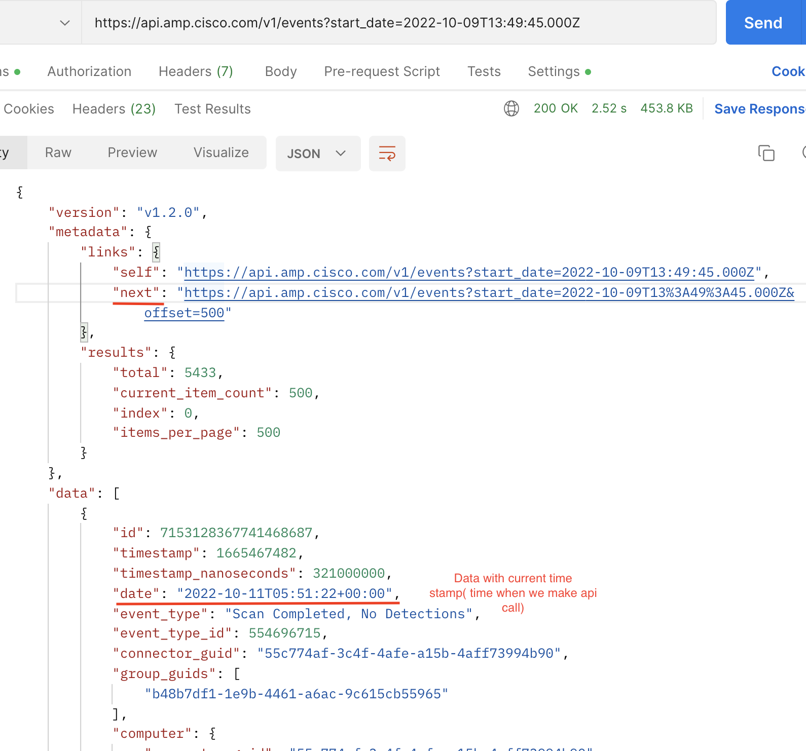
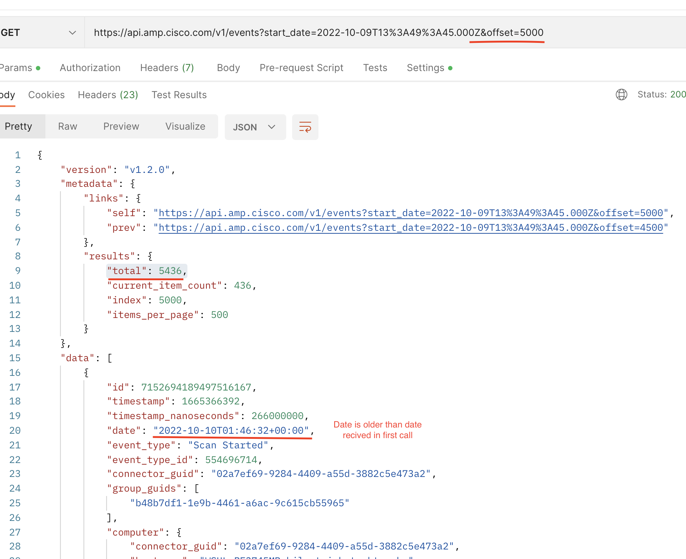

# Ciscoamp collector
Alert Logic Ciscoamp AWS Based API Poll (PAWS) Log Collector Library.

# Overview
This repository contains the AWS JavaScript Lambda function and CloudFormation 
Template (CFT) for deploying a log collector in AWS which will poll Cisco AMP (Audit Logs, Events) service API to collect and 
forward logs to the Alert Logic CloudInsight backend services.

# Installation

### 1. How to obtain an API Client ID and API Key

[Authentication](https://api-docs.amp.cisco.com/api_resources?api_host=api.amp.cisco.com&api_version=v1)

1. Log in to your AMP for Endpoints Console.
2. Go to Accounts > API Credentials.<br />

3. Click on `New API Credential`.<br />

4. Popup window will open > Set your Application name with Scope `Read-only` and Click on Create. button.<br />


### 2. API Docs

1. [Authentication](https://api-docs.amp.cisco.com/api_resources?api_host=api.amp.cisco.com&api_version=v1) 
2. [AuditLogs](https://api-docs.amp.cisco.com/api_actions/details?api_action=GET+%2Fv1%2Faudit_logs&api_host=api.amp.cisco.com&api_resource=AuditLog&api_version=v1)
3. [Events](https://api-docs.amp.cisco.com/api_actions/details?api_action=GET+%2Fv1%2Fevents&api_host=api.amp.cisco.com&api_resource=Event&api_version=v1)  

### 3. CloudFormation Template (CFT)

Refer to [CF template readme](./cfn/README-CISCOAMP.md) for installation instructions.

# How it works

### 1. Update Trigger

The `Updater` is a timer triggered function that runs a deployment sync operation 
every 12 hours in order to keep the collector lambda function up to date.
The `Updater` syncs from the Alert Logic S3 bucket where you originally deployed from.

### 2. Collection Trigger

The `Collector` function is an AWS lambda function which is triggered by SQS which contains collection state message.
During each invocation the function polls 3rd party service log API and sends retrieved data to 
AlertLogic `Ingest` service for further processing.

### 3. Checkin Trigger

The `Checkin` Scheduled Event trigger is used to report the health and status of 
the Alert Logic AWS lambda collector to the `Azcollect` back-end service based on 
an AWS Scheduled Event that occurs every 15 minutes.


# Development

### 1. Creating New Collector Types
run `npm run create-collector <<name>> <<version>> <<console log info prefix>>` to create a skeleton collector in the `collectors` folder.

example `npm run create-collector ciscoamp 1.0.0 CAMP`

### 2. Build collector
Clone this repository and build a lambda package by executing:
```
$ git clone https://github.com/alertlogic/paws-collector.git
$ cd paws-collector/collectors/ciscoamp
$ make deps test package
```

The package name is *al-ciscoamp-collector.zip*

### 3. Debugging

To get a debug trace, set an Node.js environment variable called DEBUG and
specify the JavaScript module/s to debug.

E.g.

```
export DEBUG=*
export DEBUG=index
```

Or set an environment variable called "DEBUG" in your AWS stack (using the AWS 
console) for a collector AWS Lambda function, with value "index" or "\*".

See [debug](https://www.npmjs.com/package/debug) for further details.

### 4. Invoking locally

In order to invoke lambda locally please follow the [instructions](https://docs.aws.amazon.com/lambda/latest/dg/sam-cli-requirements.html) to install AWS SAM.
AWS SAM uses `default` credentials profile from `~/.aws/credentials`.

  1. Encrypt the key using aws cli:
```
aws kms encrypt --key-id KMS_KEY_ID --plaintext AIMS_SECRET_KEY
```
  2. Include the encrypted token, and `KmsKeyArn` that you used in Step 1 inside my SAM yaml:
```
    KmsKeyArn: arn:aws:kms:us-east-1:xxx:key/yyy
    Environment:
        Variables:
```
  3. Fill in environment variables in `env.json` (including encrypted AIMS secret key) and invoke locally:

```
cp ./local/env.json.tmpl ./local/env.json
vi ./local/env.json
make test
make sam-local
```
  4. Please see `local/event.json` for the event payload used for local invocation.
Please write your readme here


# Flow Digram


# EventApi duplication Scenario
When collector is lacking behind and pages are more than maxPagesPerInvocation(Default is 10).
Cisco AMP api return the data in descending order, as we go through pages, data become older. If we pick the date from last received page for next collection then that date is older and not the current value still which we already fetch the data. 
When we start next collection it adding duplicate data.
Explain  with example :
If I make api call(https://api.amp.cisco.com/v1/events?start_date=2022-10-09T13:49:45.000Z) at 11-10-2022T05:52:000Z (UTC), api return the data since last min till start_date value.


Total record recived in api call `"total": 5436` and each page it return with 500 records. In one invocation we can read max 10 pages. In this scenario we need one more invocation to fetch rest of data.
When we read all pages and reached to last one then metadata data does not have **next page link** and so we were fetching the date from received message which is older as show below in screen shot
