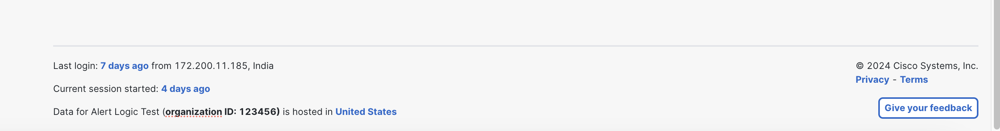
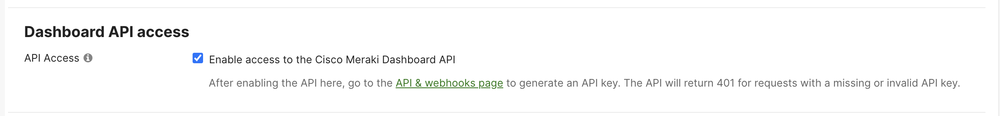
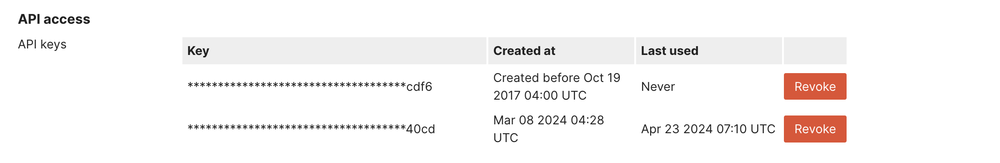

# Ciscomeraki collector
Alert Logic Ciscomeraki AWS Based API Poll (PAWS) Log Collector Library.

# Overview
This repository contains the AWS JavaScript Lambda function and CloudFormation 
Template (CFT) for deploying a log collector in AWS which will poll Ciscomeraki (Network Events) service API to collect and 
forward logs to the Alert Logic CloudInsight backend services.

# Installation

# Cisco Meraki Dashboard Log Collection Setup

Instructions for setting up log collection from Cisco Meraki Dashboard using its API.

## Prerequisites

1. **Cisco Meraki Dashboard Account**: You need to have access to a Cisco Meraki Dashboard account with administrative privileges.
2. **API Key**: Generate an API key from the Cisco Meraki Dashboard. Follow [this guide](https://developer.cisco.com/meraki/api-v1/authorization/) to obtain your API key.

## Setup Steps

1. **Enable API Access**:
   - Log in to your [Cisco Meraki Dashboard](https://dashboard.meraki.com) account.
   - You need to have access to organizational level administrative privileges.
   -  Get the Organization ID at the bottom of the page .
   - Navigate to *Organization > Settings*.
   - Under *Dashboard API access*, enable API access .

2. **Generate API Key**:
   - Go to *My Profile*.
   - Under *API access*, generate a new API key .

3. **Collect Network Events**:
   - Refer to the [Cisco Meraki Dashboard API documentation](https://developer.cisco.com/meraki/api/) for details on how to use the API to retrieve [network events](https://developer.cisco.com/meraki/api-v1/get-network-events/).
   - Example API endpoint: `GET /organizations/{organizationId}/networks/{networkId}/events`

4. **Handle Authentication**:
   - Include your API key in the request headers for authentication.
   - Example: `X-Cisco-Meraki-API-Key: YOUR_API_KEY`

### Rate Limits
- Cisco Meraki Dashboard imposes rate limits on API requests to ensure fair usage and prevent abuse. Refer to the [Rate Limits documentation](https://developer.cisco.com/meraki/api-v1/rate-limit/) for details on the specific limits for different endpoints.
- Ensure that your application adheres to these rate limits to avoid throttling errors.

### Organization Call Budget
- Each Meraki organization has a call budget of **10 requests per second**, regardless of the number of API applications interacting with that organization. 

### Throttling Errors
- Throttling errors occur when your API requests exceed the allowed rate limit. When a throttling error occurs, the API will return an HTTP 429 status code along with an error message.
- Refer to the [Throttling Errors documentation](https://developer.cisco.com/meraki/api/#/rest/guides/throttling-errors) for information on how to handle throttling errors and retry mechanisms.

### 2. API Docs

1. [Network Events](https://developer.cisco.com/meraki/api-v1/get-network-events/)

   This endpoint allows you to retrieve network events from **all networks** within an organization, filtered by specific product types such as "appliance", "switch", and more. These events provide insights into network changes, device status updates, and other relevant activities.


API URLs required for Ciscomeraki collector for Example

|     URL                              |
|--------------------------------------|
|   https://n219.meraki.com/organizations/{organizationId}/networks/{networkId}/events   |            

## Support

If you encounter any issues or have questions, please reach out to Cisco Meraki support or refer to their documentation.

Refer to [CF template readme](./cfn/README.md) for installation instructions.

# How it works

## Update Trigger

The `Updater` is a timer triggered function that runs a deployment sync operation 
every 12 hours in order to keep the collector lambda function up to date.
The `Updater` syncs from the Alert Logic S3 bucket where you originally deployed from.

## Collection Trigger

The `Collector` function is an AWS lambda function which is triggered by SQS which contains collection state message.
During each invocation the function polls 3rd party service log API and sends retrieved data to 
AlertLogic `Ingest` service for further processing.

## Checkin Trigger

The `Checkin` Scheduled Event trigger is used to report the health and status of 
the Alert Logic AWS lambda collector to the `Azcollect` back-end service based on 
an AWS Scheduled Event that occurs every 15 minutes.


# Development

## Creating New Collector Types
run `npm run create-collector <<name>> <<version>>` to create a skeleton collector in the `collectors` folder.

## Build collector
Clone this repository and build a lambda package by executing:
```
$ git clone https://github.com/alertlogic/paws-collector.git
$ cd paws-collector/collectors/ciscomeraki
$ make deps test package
```

The package name is *al-ciscomeraki-collector.zip*

## Debugging

To get a debug trace, set an Node.js environment variable called DEBUG and
specify the JavaScript module/s to debug.

E.g.

```
export DEBUG=*
export DEBUG=index
```

Or set an environment variable called "DEBUG" in your AWS stack (using the AWS 
console) for a collector AWS Lambda function, with value "index" or "\*".

See [debug](https://www.npmjs.com/package/debug) for further details.

## Invoking locally

In order to invoke lambda locally please follow the [instructions](https://docs.aws.amazon.com/lambda/latest/dg/sam-cli-requirements.html) to install AWS SAM.
AWS SAM uses `default` credentials profile from `~/.aws/credentials`.

  1. Encrypt the key using aws cli:
```
aws kms encrypt --key-id KMS_KEY_ID --plaintext AIMS_SECRET_KEY
```
  2. Include the encrypted token, and `KmsKeyArn` that you used in Step 1 inside my SAM yaml:
```
    KmsKeyArn: arn:aws:kms:us-east-1:xxx:key/yyy
    Environment:
        Variables:
```
  3. Fill in environment variables in `env.json` (including encrypted AIMS secret key) and invoke locally:

```
cp ./local/env.json.tmpl ./local/env.json
vi ./local/env.json
make test
make sam-local
```
  4. Please see `local/event.json` for the event payload used for local invocation.
Please write your readme here

