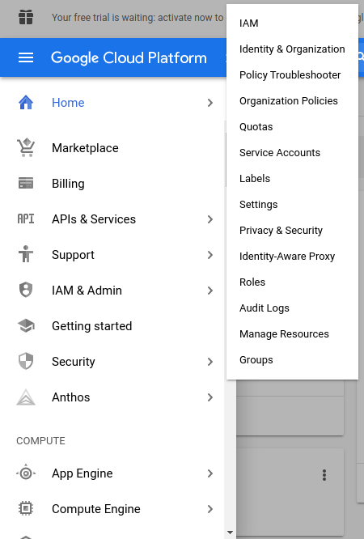
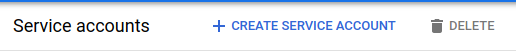
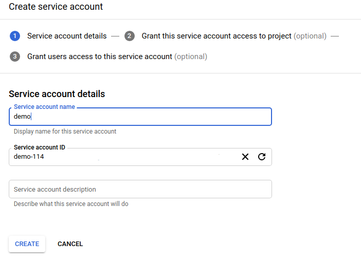
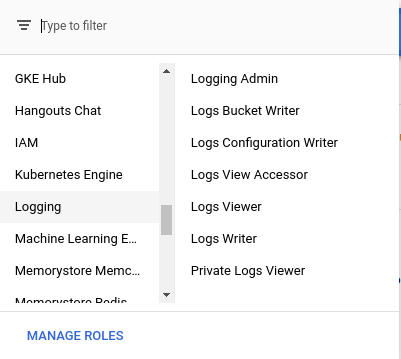
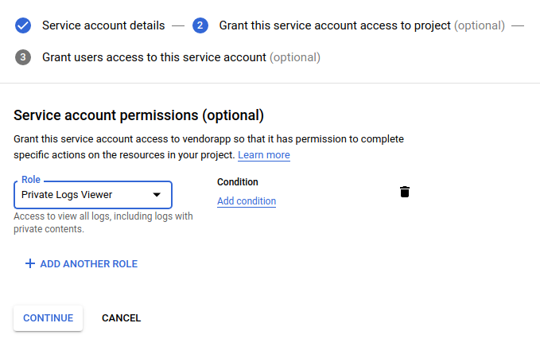
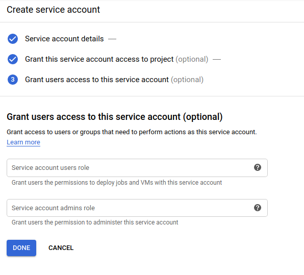
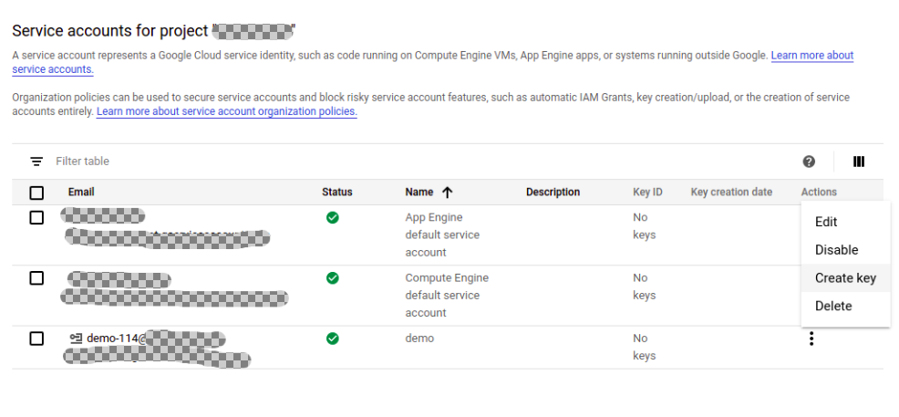
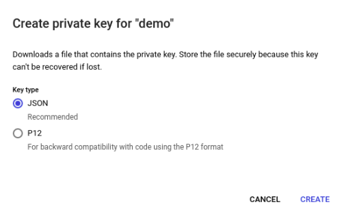

# Googlestackdriver collector
Alert Logic Googlestackdriver AWS Based API Poll (PAWS) Log Collector Library.

# Overview
This repository contains the AWS JavaScript Lambda function and CloudFormation 
Template (CFT) for deploying a log collector in AWS which will poll Googlestackdriver (ListLogEntries) service API to collect and 
forward logs to the Alert Logic CloudInsight backend services.

# Installation

### 1. Generate Google API key
1. In the Google Cloud Console, open the sidebar and in the *IAM & Admin* dropdown, select *Service Accounts*.<br /><br />
<br />
2. Select *Create Service Account* at the top of the list.<br /><br />
<br />
3. Enter a service account name and a service account description (optional) and click *Create*.<br /><br />
<br />
4. From the Role list, select *Logging*, then *Private Log Viewer* and click *Continue*.<br /><br />
<br />
<br />
5. Grant any user permissions, if desired, and click *Done*.<br /><br />
<br />
6. Click the *Actions* menu beside the newly created service account and select *Create Key*.<br /><br />
<br />
7. Select *JSON* and click *Create*. The key will be downloaded to your computer as a JSON file.<br /><br />
<br />

### 2. API Docs

1. [Googlestackdriver_Node_Library](https://www.npmjs.com/package/@google-cloud/logging)
2. [Setup_API](https://cloud.google.com/nodejs/docs/reference/logging/2.0.x/v2.LoggingServiceV2Client#listLogEntries)


### 3. CloudFormation Template (CFT)
Refer to [CF template readme](./cfn/README-GOOGLESTACKDRIVER.md) for installation instructions.

# How it works

### 1. Update Trigger

The `Updater` is a timer triggered function that runs a deployment sync operation 
every 12 hours in order to keep the collector lambda function up to date.
The `Updater` syncs from the Alert Logic S3 bucket where you originally deployed from.

### 2. Collection Trigger

The `Collector` function is an AWS lambda function which is triggered by SQS which contains collection state message.
During each invocation the function polls 3rd party service log API and sends retrieved data to 
AlertLogic `Ingest` service for further processing.

### 3. Checkin Trigger

The `Checkin` Scheduled Event trigger is used to report the health and status of 
the Alert Logic AWS lambda collector to the `Azcollect` back-end service based on 
an AWS Scheduled Event that occurs every 15 minutes.


# Development

### 1. Creating New Collector Types
run `npm run create-collector <<name>> <<version>> <<console log info prefix>>` to create a skeleton collector in the `collectors` folder.

example `npm run create-collector googlestackdriver 1.0.0 GSTA`

### 2. Build collector
Clone this repository and build a lambda package by executing:
```
$ git clone https://github.com/alertlogic/paws-collector.git
$ cd paws-collector/collectors/googlestackdriver
$ make deps test package
```

The package name is *al-googlestackdriver-collector.zip*

### 3. Debugging

To get a debug trace, set an Node.js environment variable called DEBUG and
specify the JavaScript module/s to debug.

E.g.

```
export DEBUG=*
export DEBUG=index
```

Or set an environment variable called "DEBUG" in your AWS stack (using the AWS 
console) for a collector AWS Lambda function, with value "index" or "\*".

See [debug](https://www.npmjs.com/package/debug) for further details.

### 4. Invoking locally

In order to invoke lambda locally please follow the [instructions](https://docs.aws.amazon.com/lambda/latest/dg/sam-cli-requirements.html) to install AWS SAM.
AWS SAM uses `default` credentials profile from `~/.aws/credentials`.

  1. Encrypt the key using aws cli:
```
aws kms encrypt --key-id KMS_KEY_ID --plaintext AIMS_SECRET_KEY
```
  2. Include the encrypted token, and `KmsKeyArn` that you used in Step 1 inside my SAM yaml:
```
    KmsKeyArn: arn:aws:kms:us-east-1:xxx:key/yyy
    Environment:
        Variables:
```
  3. Fill in environment variables in `env.json` (including encrypted AIMS secret key) and invoke locally:

```
cp ./local/env.json.tmpl ./local/env.json
vi ./local/env.json
make test
make sam-local
```
  4. Please see `local/event.json` for the event payload used for local invocation.
Please write your readme here
