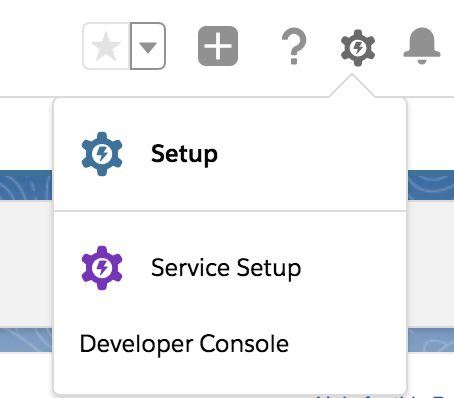
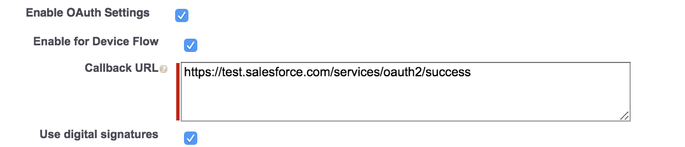
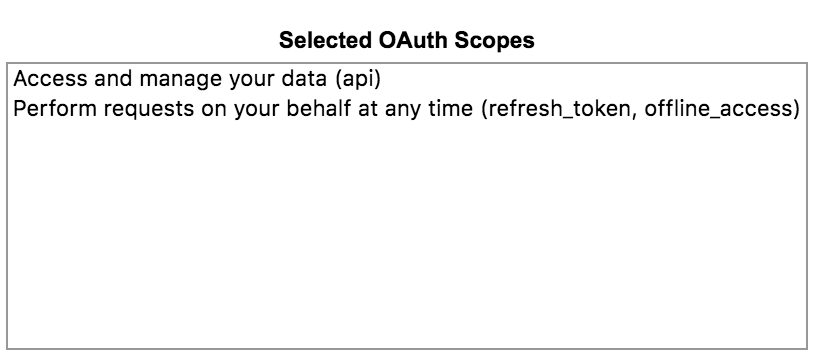

# Salesforce collector
Alert Logic Salesforce AWS Based API Poll (PAWS) Log Collector Library.

# Overview
This repository contains the AWS JavaScript Lambda function and CloudFormation 
Template (CFT) for deploying a log collector in AWS which will poll 3rd party service API to collect and 
forward logs to the Alert Logic CloudInsight backend services.

# Installation

### 1. How to obtain an API Secret Key and API ID
Before these steps ensure a digital certificate is generated. 

1. Configure a Permission Set
    - Click the cog in the top right of the Salesforce console, then click Setup
      
    - In `Administration`, expand the Users tab and click Permission Sets.
    - Click the permission set you want to grant access to
    - Click 'System Permissions'
    - Check the following checkboxes:
        - [x] Apex REST Services 
        - [x] API Enabled 
        - [x] View Event Log Files 
        - [x] Manage Users (Required for LoginHistory objects only to view associated geo-data)

2. Create a Client App  
    - Click the cog in the top right, then click Setup
    - In the sidebar, click Apps > click App Manager
    - Click ‘New Connected App’
    - In the Basic Information section, fill in the required fields
    - In the API section, check ‘Enable OAuth Settings’, check ‘Enable for Device Flow’ and enter a call-back URL.
      
    - Check the ‘Use Digital Signatures’ checkbox and click Choose File and upload the server.crt file that contains your digital certificate.
    - Add ‘Perform requests on your behalf at any time’ and ‘Access and manage your data’ in the selected OAuth scopes
      
    - Cick ‘Save’ at the bottom
    - Click Manage.
    - Click Edit Policies.
    - In the OAuth Policies section, select Admin approved users are pre-authorized for Permitted Users, and click OK.
    - Click Save.
    - Click Manage Profiles and then click Manage Permission Sets. Select the previously created permission set.   

### 2. API Object List
[LoginHistory](https://developer.salesforce.com/docs/atlas.en-us.api.meta/api/sforce_api_objects_loginhistory.htm),
[EventLogFile](https://developer.salesforce.com/docs/atlas.en-us.api.meta/api/sforce_api_objects_eventlogfile.htm),
[LoginEvent](https://developer.salesforce.com/docs/atlas.en-us.224.0.platform_events.meta/platform_events/sforce_api_objects_loginevent.htm),
[LoginGeo](https://developer.salesforce.com/docs/atlas.en-us.api.meta/api/sforce_api_objects_logingeo.htm),
[User](https://developer.salesforce.com/docs/atlas.en-us.object_reference.meta/object_reference/sforce_api_objects_user.htm),
[ApiEvent](https://developer.salesforce.com/docs/atlas.en-us.platform_events.meta/platform_events/sforce_api_objects_apievent.htm),
[LoginEvent](https://developer.salesforce.com/docs/atlas.en-us.platform_events.meta/platform_events/sforce_api_objects_loginevent.htm),
[LogoutEvent](https://developer.salesforce.com/docs/atlas.en-us.platform_events.meta/platform_events/sforce_api_objects_logoutevent.htm),
[LoginAsEvent](https://developer.salesforce.com/docs/atlas.en-us.platform_events.meta/platform_events/sforce_api_objects_loginasevent.htm),

[API_Throttling](https://help.magentrix.com/articles/knowledge/Error-REQUEST_LIMIT_EXCEEDED-1-5-2017)


### 3. CloudFormation Template (CFT)

Refer to [CF template readme](./cfn/README-SALESFORCE.md) for installation instructions.

# How it works

### 1. Update Trigger

The `Updater` is a timer triggered function that runs a deployment sync operation 
every 12 hours in order to keep the collector lambda function up to date.
The `Updater` syncs from the Alert Logic S3 bucket where you originally deployed from.

### 2. Collection Trigger

The `Collector` function is an AWS lambda function which is triggered by SQS which contains collection state message.
During each invocation the function polls 3rd party service log API and sends retrieved data to 
AlertLogic `Ingest` service for further processing.

### 3. Checkin Trigger

The `Checkin` Scheduled Event trigger is used to report the health and status of 
the Alert Logic AWS lambda collector to the `Azcollect` back-end service based on 
an AWS Scheduled Event that occurs every 15 minutes.


# Development

### 1. Creating New Collector Types
run `npm run create-collector <<name>> <<version>> <<console log info prefix>>` to create a skeleton collector in the `collectors` folder.

example `npm run create-collector salesforce 1.0.0 SALE`

### 2. Build collector
Clone this repository and build a lambda package by executing:
```
$ git clone https://github.com/alertlogic/paws-collector.git
$ cd paws-collector/collectors/salesforce
$ make deps test package
```

The package name is *al-salesforce-collector.zip*

### 3. Debugging

To get a debug trace, set an Node.js environment variable called DEBUG and
specify the JavaScript module/s to debug.

E.g.

```
export DEBUG=*
export DEBUG=index
```

Or set an environment variable called "DEBUG" in your AWS stack (using the AWS 
console) for a collector AWS Lambda function, with value "index" or "\*".

See [debug](https://www.npmjs.com/package/debug) for further details.

### 4. Invoking locally

In order to invoke lambda locally please follow the [instructions](https://docs.aws.amazon.com/lambda/latest/dg/sam-cli-requirements.html) to install AWS SAM.
AWS SAM uses `default` credentials profile from `~/.aws/credentials`.

  1. Encrypt the key using aws cli:
```
aws kms encrypt --key-id KMS_KEY_ID --plaintext AIMS_SECRET_KEY
```
  2. Include the encrypted token, and `KmsKeyArn` that you used in Step 1 inside my SAM yaml:
```
    KmsKeyArn: arn:aws:kms:us-east-1:xxx:key/yyy
    Environment:
        Variables:
```
  3. Fill in environment variables in `env.json` (including encrypted AIMS secret key) and invoke locally:

```
cp ./local/env.json.tmpl ./local/env.json
vi ./local/env.json
make test
make sam-local
```
  4. Please see `local/event.json` for the event payload used for local invocation.
Please write your readme here

