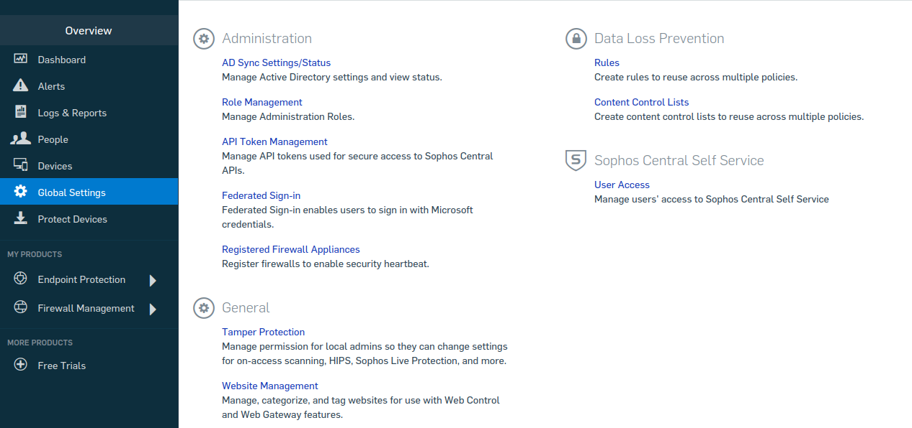
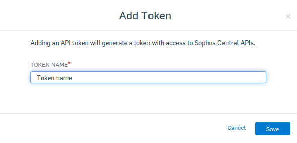
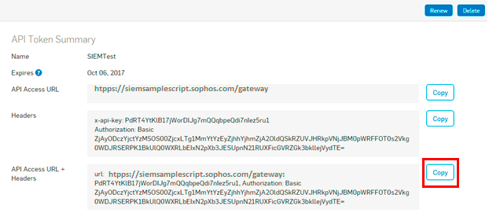

# Sophossiem collector
Alert Logic Sophossiem AWS Based API Poll (PAWS) Log Collector Library.

# Overview
This repository contains the AWS JavaScript Lambda function and CloudFormation 
Template (CFT) for deploying a log collector in AWS which will poll Sophos SIEM (alert, event)  service API to collect and 
forward logs to the Alert Logic CloudInsight backend services.

# Installation

### 1. How to obtain token

1. In Sophos Central Admin, go to Global Settings > API Token Management.<br />
<br />
2. To create a new token, click Add token from the top-right corner of the screen.<br />
3. Select a token name and click Save. The API Token Summary for this token is displayed.<br />
<br />
4. Click on Copy to copy your API Access URL and Headers from the API Token Summary section into your clipboard.<br />
<br />

### 2. API Docs

1. How to send alert and event data to your SIEM [Link](https://support.sophos.com/support/s/article/KB-000036372?language=en_US)

2. How to access the swagger definition. 
    - You can download Swagger documentation on the API [here](https://central-public-prod-api.s3.amazonaws.com/swagger-api-specification-us-west-2).
    - You can view the downloaded Swagger file using the [Swagger_Editor](https://editor.swagger.io/#/).
    - This data contains API specifications for a several Sophos API functions. The ones specific to SIEM are:
        - event-controller-v-1-impl (select Get to see information about this)
        - alert-controller-v-1-impl (select Get to see information about this)
        - AlertAggregate (Model - explains what fields are used. eg. created_at, or customer_id, etc. )
        - EventAggregate (Model - explains what fields are used eg. created_at, or customer_id, etc. )
    - Sophos Support is available only for the two SIEM APIs (Events + Alerts) and our unmodified script. We do not provide advice and troubleshooting for customer created integrations

3. [FAQs_on_SIEM](https://support.sophos.com/support/s/article/KB-000036413?language=en_US)

### 3. CloudFormation Template (CFT)

Refer to [CF template readme](./cfn/README-SOPHOSSIEM.md) for installation instructions.

# How it works

### 1. Update Trigger

The `Updater` is a timer triggered function that runs a deployment sync operation 
every 12 hours in order to keep the collector lambda function up to date.
The `Updater` syncs from the Alert Logic S3 bucket where you originally deployed from.

### 2. Collection Trigger

The `Collector` function is an AWS lambda function which is triggered by SQS which contains collection state message.
During each invocation the function polls 3rd party service log API and sends retrieved data to 
AlertLogic `Ingest` service for further processing.

### 3. Checkin Trigger

The `Checkin` Scheduled Event trigger is used to report the health and status of 
the Alert Logic AWS lambda collector to the `Azcollect` back-end service based on 
an AWS Scheduled Event that occurs every 15 minutes.


# Development

### 1. Creating New Collector Types
run `npm run create-collector <<name>> <<version>> <<console log info prefix>>` to create a skeleton collector in the `collectors` folder.

example `npm run create-collector sophossiem 1.0.0 SIEM`

### 2. Build collector
Clone this repository and build a lambda package by executing:
```
$ git clone https://github.com/alertlogic/paws-collector.git
$ cd paws-collector/collectors/sophossiem
$ make deps test package
```

The package name is *al-sophossiem-collector.zip*

### 3. Debugging

To get a debug trace, set an Node.js environment variable called DEBUG and
specify the JavaScript module/s to debug.

E.g.

```
export DEBUG=*
export DEBUG=index
```

Or set an environment variable called "DEBUG" in your AWS stack (using the AWS 
console) for a collector AWS Lambda function, with value "index" or "\*".

See [debug](https://www.npmjs.com/package/debug) for further details.

### 4. Invoking locally

In order to invoke lambda locally please follow the [instructions](https://docs.aws.amazon.com/lambda/latest/dg/sam-cli-requirements.html) to install AWS SAM.
AWS SAM uses `default` credentials profile from `~/.aws/credentials`.

  1. Encrypt the key using aws cli:
```
aws kms encrypt --key-id KMS_KEY_ID --plaintext AIMS_SECRET_KEY
```
  2. Include the encrypted token, and `KmsKeyArn` that you used in Step 1 inside my SAM yaml:
```
    KmsKeyArn: arn:aws:kms:us-east-1:xxx:key/yyy
    Environment:
        Variables:
```
  3. Fill in environment variables in `env.json` (including encrypted AIMS secret key) and invoke locally:

```
cp ./local/env.json.tmpl ./local/env.json
vi ./local/env.json
make test
make sam-local
```
  4. Please see `local/event.json` for the event payload used for local invocation.
Please write your readme here

